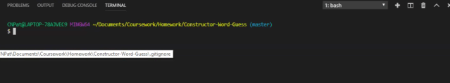
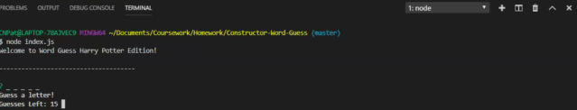
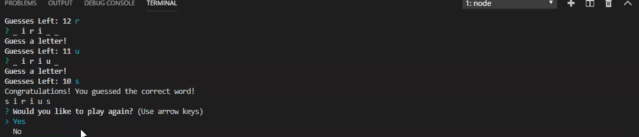
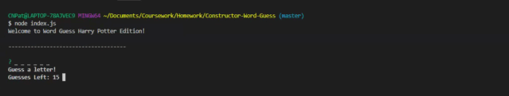

# Constructor-Word-Guess

## Constructor Word Guess Harry Potter Edition

Constuctor Word Guess is a command line node application that utilizes constructor functions to create a word guess game. Test your knowledge of the wizarding world! 

## How To Use
To play this game: 
* Clone this repository
* Run command "npm install" in Terminal
* Run command "node index.js" 
* A word play prompt will appear allowing you to input a letter as you try to guess the word. 
* The game has the option of once you have either guessed correctly, or ran out of guess to continue game play. 

## Tech Used
* Node.js
* Inquirer NPM Package
* JavaScript Constructor Functions

## The App in Action

### Game Start

Here is a preview of the Game Start.

### Game Win

Here is a preview of guessing the correct word. 

### Game Play Again

Here is a preview of the game continuation option. 

### Game Loss

Here is a preview of the running out of guesses. 

